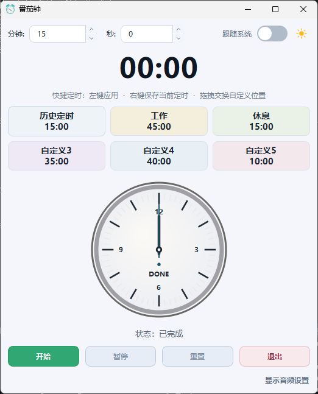

<p align="center">
  
</p>

<h1 align="center">TomatoClock</h1>

<p align="center">
  基于 Qt/C++ 的桌面番茄钟应用，支持表盘可视化、音频提醒、系统托盘、主题切换与快捷定时。
</p>

<p align="center">
  <a href="https://github.com/fangjzh/TomatoClock/stargazers"></a>
  <a href="https://github.com/fangjzh/TomatoClock/network/members"></a>
  <a href="https://github.com/fangjzh/TomatoClock/issues"></a>
  <a href="https://github.com/fangjzh/TomatoClock/releases"></a>
  <a href="LICENSE"></a>
</p>

> GitHub 仓库地址已设置为 `fangjzh/TomatoClock`。

## 主要特性

- 倒计时核心流程：开始、暂停/继续、重置。
- 圆形表盘可视化：分针/秒针随剩余时间联动。
- 到时提醒：弹窗 + 音频（支持 `wav/mp3`，可循环、可调音量）。
- 快捷定时：历史定时 + 5 个自定义预设（支持重命名、拖拽交换）。
- 桌面体验：系统托盘最小化运行、单实例保护。
- 主题模式：跟随系统 / 浅色 / 深色。

## 软件截图



> 当前仓库使用占位图。你可以把真实截图覆盖到 `resource/images/screenshot-main.png`，README 会自动展示。

## 快速开始

### 环境要求

- Windows 10/11
- Qt 5.15+ 或 Qt 6.x（Widgets）
- CMake 3.5+
- C++17 编译器

### 构建

```powershell
cmake -S . -B build -DCMAKE_BUILD_TYPE=Release
cmake --build build --config Release
```

### 打包

```powershell
./script/package.ps1 -BuildType Release
```

打包产物位于 `dist/`，并自动附带必要许可证材料：`LICENSE`、`NOTICE`、`COPYRIGHT`、`licenses/`。

## 文档

- 运行说明：`doc/RUN.md`
- 用户手册：`doc/USER_MANUAL.md`
- 编译说明：`doc/BUILD.md`

## GitHub 趋势与统计

你可以在 README 中直接展示 GitHub 指标与 Star 趋势，常见写法如下：

```markdown
[](https://star-history.com/#fangjzh/TomatoClock&Date)
```

[](https://star-history.com/#fangjzh/TomatoClock&Date)

> 结论：可以附上 star 趋势、fork、issues、release 等 GitHub 信息，这些都是开源项目常用展示方式。

## License

本项目采用 GPL-3.0 开源许可，详见 `LICENSE`。
